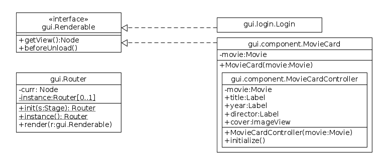
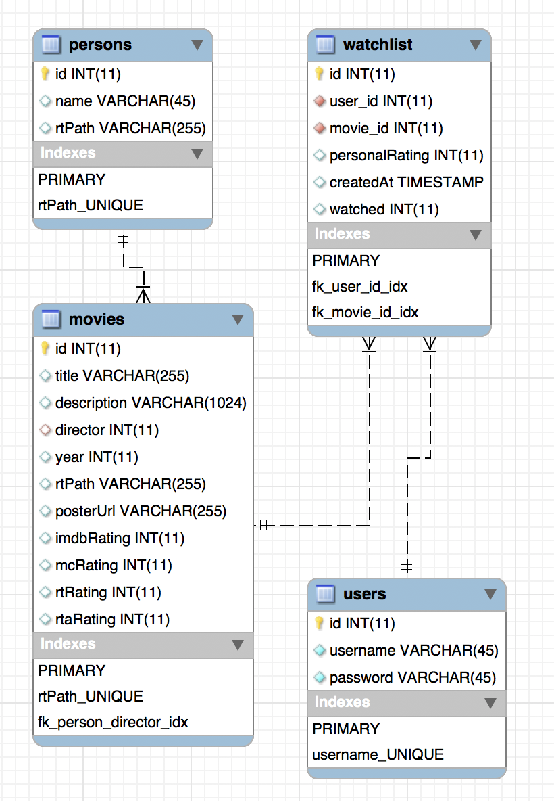

# Semesteraufgabe

## Ausführen:

Benötigt JRE 10 (oder neuer).

 - Unter Windows: Doppel-Click auf `übung7-gruppe6.rar`
 - Unter Linux / MacOS(?): Im terminal: (in den Ordner navigieren und dann) `java -jar übung7-gruppe6.jar`
 
Wenn der Quellcode selbst ausgeführt werden soll muss JavaFX Installiert sein. [Tutorial for Eclipse](https://www.eclipse.org/efxclipse/install.html#for-the-lazy). Das mitgelieferte jar ist bereits mit javafx kompiliert worde, benötigt also keine weiteren bibliotheken.

Außerdem werden MySQL Treiber und java-json Bibliotheken gebraucht, die im Projekt enthalten sind.

Wir verwenden einen Scraper, der RottenTomatoes und IMDB scraped. Dieser ist komplett von uns in PHP geschrieben und wird auf antonlydike.de/scraper gehostet (mit api-key versehen). Er kommuniziert mit Java über JSON. Der Quellcode dafür liegt bei, muss jedoch nicht selber gehostet werden damit das Program funktioniert. 

Die Datenbank wird ebenfalls von Anton gehostet.

## Benutzung:

Ein paar Tipps zur benutzung:

 - Doppel-Klick auf Film öffnet eine detailreichere Übersicht.
 - Um einen Film zur Watchlist hinzuzufügen, muss auf den Button oben links (in der watchlist ansicht) geklickt werden.
 - Um einen eigenen Film hinzuzufügen, muss in der Suche ganz nach unten gescrollt werden und dann auf "Add custom movie" geklickt werden.

## Systembeschreibung: Filmdatenbank

Es soll ein System zur Verwaltung von Filmen und Watchlists erstellt werden. Mit dem System sollen
Filme mit verschiedenen Daten (wie Name, Produktionsjahr und Regisseur) erfasst, angezeigt und bearbeitet
werden können. Filme sollen außerdem als gesehen markiert werden und bewertet werden können
(z.B. auf einer Skala von 1 - 10). Schließlich soll der Benutzer Filme in Watchlists verwalten können.

 - **Technische Anforderungen:** Das System soll modular aufgebaut und leicht erweiterbar (z.B. um Serien) sein
 - **Freiwillige Zusatzaufgabe (schwer):** Filmbeschreibungen sollen aus einer Onlinefilmdatenbank importiert werden können.

## Dokumentation:

### GUI:

Der Router ist im Singleton-Muster implementiert und kann Objekte die Renderable implementieren im layout rendern.

Viele GUI-Komponenten wurden in FXML Geschrieben und haben einen internen Controller um auf Events zu reagieren / das Template mit Daten zu füllen.

### Datenbank Schicht:

Die Datenbank-Schicht wurde sehr generisch implementiert, damit Erweiterungen ohne großen Aufwand möglich sind. 
Um das Datenmodell von der Datenbank in ein Java Objekt zu transferieren, wird mit einer Annotation gearbeitet, die beim Auslesen die Felder auf die entsprechenden Attribute automatisch mappt.
Zusätzlich stehen grundlegende Funktionen, wie z.B. nach einer ID suchen, als Basis zur Verfügung und können durch einfache Vererbung verwendet werden.

### Service Schicht:

Die Service Schicht ist die Schnittstelle zwischen der Datenbank Schicht und der GUI. Hier werden alle nötigen Funktionen für die GUI
zur Verfügung gestellt.

## ToDo:

**Views**
 - [x] Login 
 - [x] Signup
 - [x] Adding new movie
 - [x] Home
 	- [x] Events verkabeln
 	- [x] Suche implementieren
 - [x] Movie details view
 	- [x] Implement rating / deleting from watchlist
 - [x] MovieCard
 	- [x] Click event verkabeln (set checked)
 	- [x] DoubleClick verkabeln (open Movie detail view)
 
**Methods in the persistence layer**
 - getWatchlist(user)
 - addToWatchlist(movie)
 - removeFromWatchlist(movie)
 - setWatched(movie, boolean watched)
 - setRating(movie, rating)
 - login(username, password)
 - register(username, password)
 
 The movie actors and persons in general are **not** stored in the DB but are pulled in real time from RT.
 